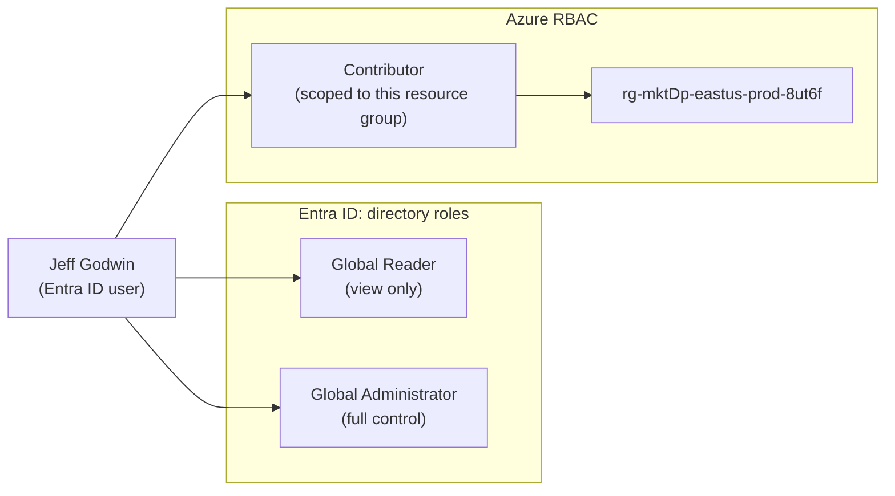
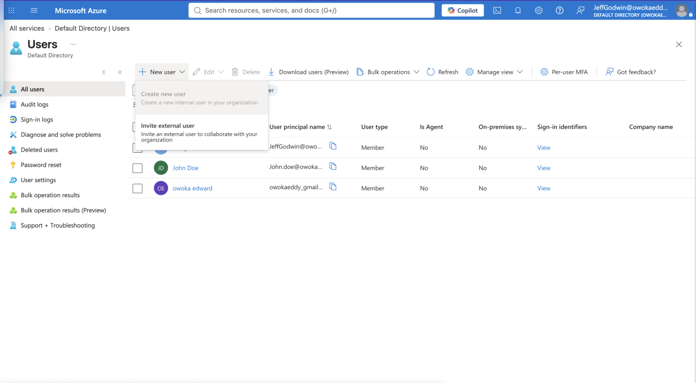
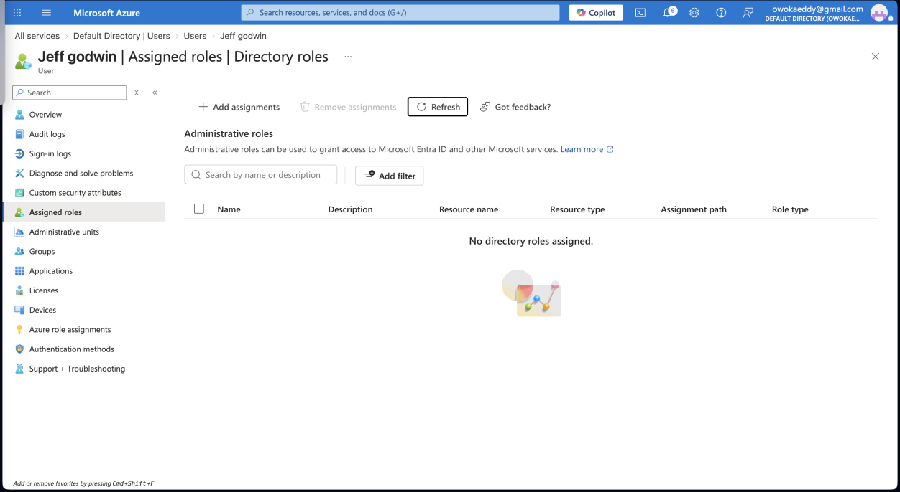
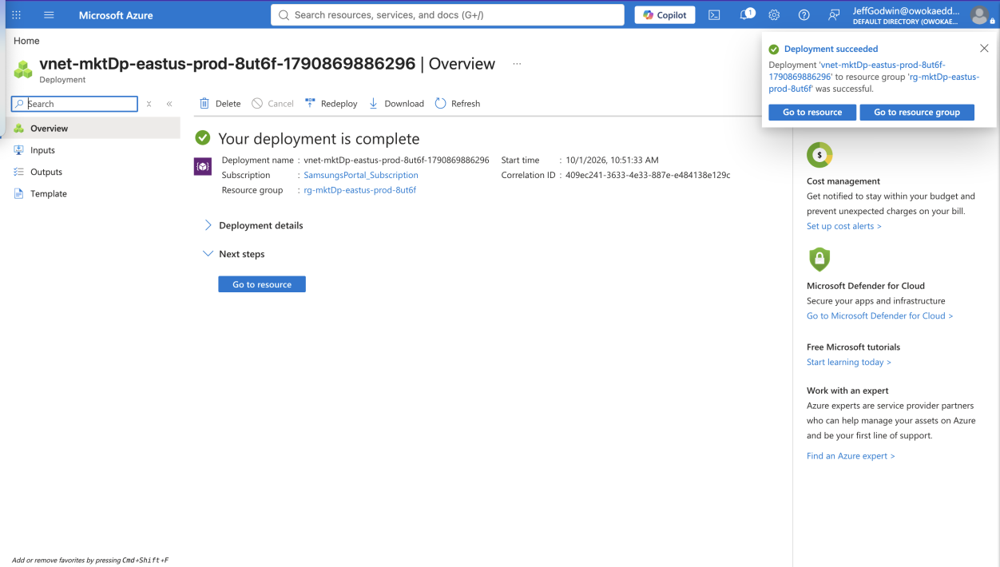
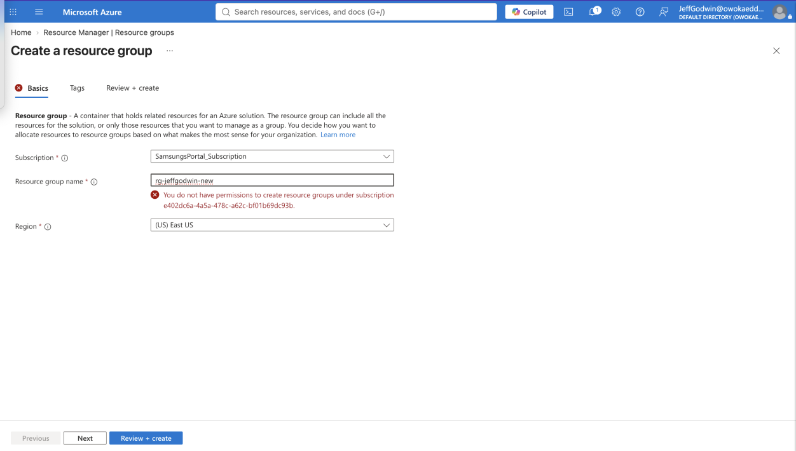
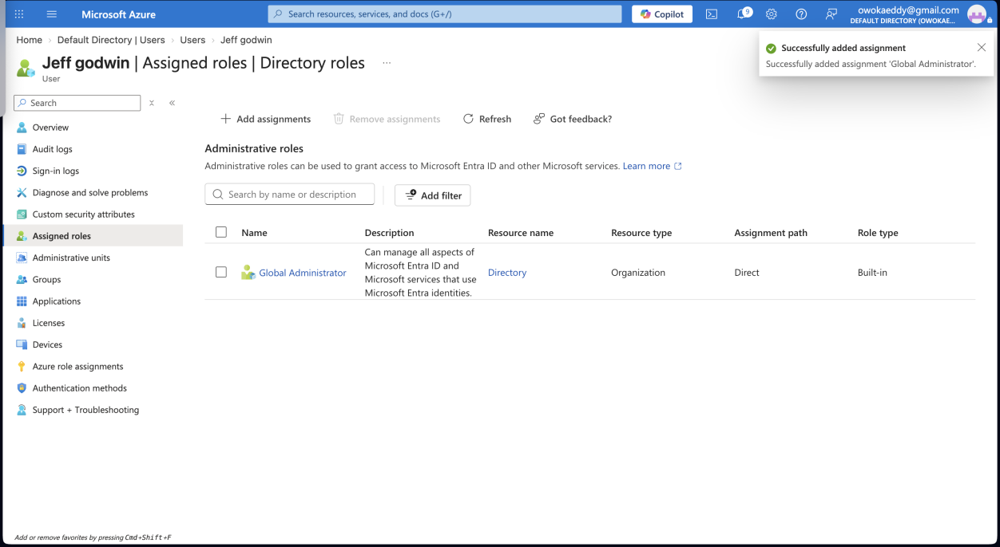
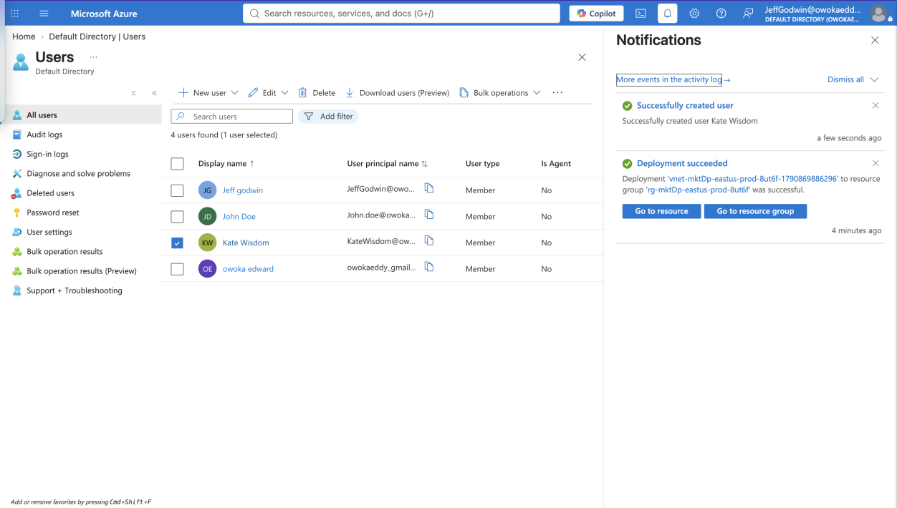

# Lab 03: Identity and Access Management with Microsoft Entra ID and Azure RBAC

**Author:** Edward Owoka | **Role:** Azure Cloud Engineer

Give a new hire exactly the access he needs, no more, using Microsoft Entra ID directory roles and Azure role-based access control (RBAC), then prove each permission works by signing in as that user.

---

## Business Scenario

TechSolutions Inc. is moving its infrastructure to Azure and wants a solid Identity and Access Management (IAM) strategy. A new hire, **Jeff Godwin**, needs specific permissions to do his job without weakening security.

My task was to create Jeff's account, grant and revoke roles step by step, and verify the result from Jeff's own portal session, following the **principle of least privilege**.

## Skills Demonstrated

- Creating and managing users in Microsoft Entra ID
- Assigning and removing **Entra ID directory roles** (Global Reader, Global Administrator)
- Assigning an **Azure RBAC role** (Contributor) scoped to a single resource group
- Understanding how **scope** limits what a role can do
- Verifying permissions by testing as the user, including expected failures
- Documenting access changes as evidence

## Two Permission Systems

A key point of this lab is that Azure has two separate role systems that are easy to confuse:

| | Entra ID roles (directory roles) | Azure RBAC roles |
|---|---|---|
| **Controls** | The directory: users, groups, tenant settings | Azure resources: subscriptions, resource groups, VMs, networks |
| **Examples used here** | Global Reader, Global Administrator | Contributor |
| **Where it is assigned** | Entra ID, then Users, then Assigned roles | Access control (IAM) on a subscription, resource group, or resource |
| **Scope** | The whole tenant | Management group, subscription, resource group, or resource |

## Lab Summary

| Task | Goal | Result |
|---|---|---|
| 1 | Global Reader: can view users and groups but not create or delete them | Create new user option unavailable to Jeff |
| 2 | Remove the role so no roles remain | No directory roles assigned |
| 3 | Contributor on `rg-mktDp-eastus-prod-8ut6f` | Jeff created a VNet in the group; creating a new resource group was denied |
| 4 | Assign Global Administrator | Role assigned |
| 5 | Create a user as Jeff | User created successfully |

---

## Walkthrough

### Task 1: Global Reader, read-only access to the directory

Created the user **Jeff Godwin** in Microsoft Entra ID and assigned him the **Global Reader** role. Global Reader can see everything in the directory but cannot change anything.

Then I signed in as Jeff and opened Users, then New user. The **Create new user** option is greyed out for him, so he cannot add users with this role.

### Task 2: Remove the role

Back in my own admin account, I removed Jeff's Global Reader assignment. The Assigned roles page for Jeff now shows **"No directory roles assigned."**

> Note: Global Reader is an Entra ID *directory* role, so it appears under Assigned roles (Directory roles), not under the *Azure role assignments* page, which lists Azure RBAC roles on resources.

### Task 3: Contributor on one resource group

As the owner, I created the resource group `rg-mktDp-eastus-prod-8ut6f` and assigned Jeff the **Contributor** role on that resource group only.

Signed in as Jeff, I tested both sides of that scope:

**Allowed:** Jeff created a virtual network inside the resource group, and the deployment succeeded. The portal header shows Jeff's account.

**Denied:** Jeff tried to create a new resource group named `rg-jeffgodwin-new`. Azure rejected it with *"You do not have permissions to create resource groups under subscription."* Contributor on a resource group does not extend to the subscription, where new resource groups are created.

<!-- Optional extra evidence: add a screenshot of the Contributor role assignment on the resource group's Access control (IAM) page, for example screenshots/03b-contributor-assignment.png -->

### Task 4: Global Administrator

From my admin account, I assigned Jeff the **Global Administrator** role. The portal confirms *"Successfully added assignment 'Global Administrator'"*, and it shows as a built-in role assigned directly to him.

### Task 5: Create a user as Jeff

Signed in as Jeff, now a Global Administrator, I created a new user in Entra ID. The notification shows **"Successfully created user Kate Wisdom"**, and the user list now includes her. The same action was not available to Jeff in Task 1, which shows the effect of the role change.

---

## Key Takeaways

- **Least privilege:** each role gave only what the task needed. Global Reader to look, Contributor to build in one place, Global Administrator only for the user-management step.
- **Scope matters.** The same Contributor role can build resources inside one resource group but cannot create new resource groups, because that happens at the subscription level.
- **Entra roles and Azure RBAC are different systems.** A directory role controls identities, while an RBAC role controls resources. Having one does not automatically give you the other.
- **Test as the user.** Checking permissions from the user's own session, including the actions that should fail, is the reliable way to confirm access is configured correctly.
- **Global Administrator is the most powerful role in a tenant.** In a real environment it should be assigned rarely, held temporarily, and reviewed.

## Cleanup

Elevated test access should not stay in place after a lab. Best practice is to remove Jeff's Global Administrator assignment and delete the test users once the evidence is captured.

## Security Note

No passwords or credentials are included in this repository.
